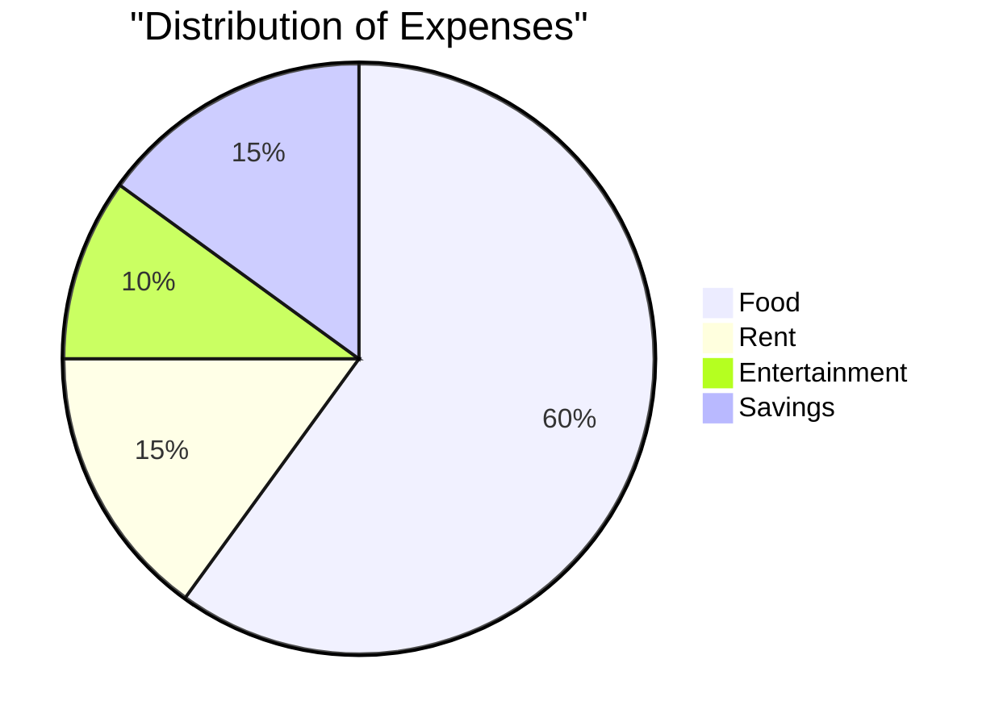

# Big Heading

This can be a general intro to the project.

## Smaller Heading

Talking about the first key point

###### Smallest heading

*Italics* v's **bold** v's plain old text

An example of a link: [Scott's Start Page](https://sak.free.nf/startpage/)

Text that is NOT a quote.

> Text that is.

Example of `code` insert ...

```
sudo apt update && sudo apt upgrade -y
```


This info and more for formatting comes from [here](https://docs.github.com/en/get-started/writing-on-github/getting-started-with-writing-and-formatting-on-github/basic-writing-and-formatting-syntax)

Or you can do it the easy way using [README.so](https://readme.so).

# Example of mermaid code


